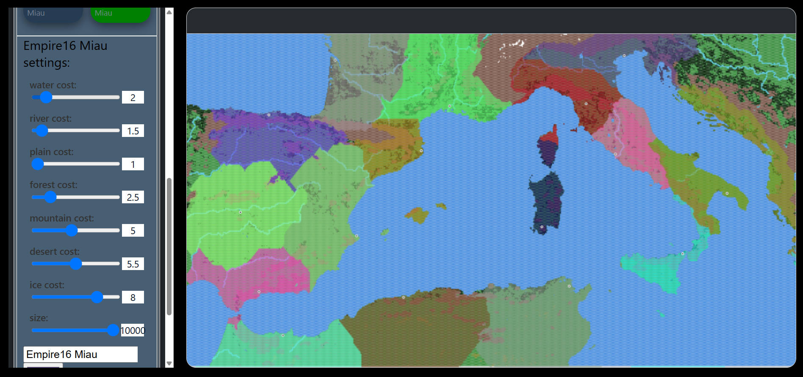

# Map Project — Territorial Expansion Simulator

A React + TypeScript app that simulates territorial expansion of configurable "empires" over .txt maps. Each empire has terrain cost presets that affect travel/speed; the simulation computes reachable cells and assigns ownership based on minimal travel cost.

## Features
- Load plain-text map files from `public/resources/maps/`.
- Configure per-terrain travel costs and terrain-change penalties per empire.
- Dijkstra-like expansion per capital using a min-heap priority queue (`src/resources/mapLgorithm.ts`).
- Select closest reachable cells (top-N) using a max-heap (`findNClosestCells`).
- Visualize ownership and expansions on canvas layers (`src/contents/Map.tsx`, `src/style/Map.css`).
- UI for map selection and empire configuration in `src/contents/`.

## Map format
- Plain text grid (.txt). Each character = terrain tile.
- Typical tokens:
  - W / R — water / river
  - P — plain
  - M — mountain
  - F — forest
  - D — desert
  - I — ice

## Key files
- `src/resources/mapLgorithm.ts` — core pathfinding and selection (searchTer, findNClosestCells)
- `src/contents/Map.tsx` — map rendering and overlays
- `src/contents/SettingContext.tsx` — empire presets & settings provider
- `src/contents/Menu*.tsx` — UI for maps and empires
- `public/resources/maps/` — example map files
- `src/style/Map.css` — canvas and map styling

## Quick start
Start dev server
```sh
npm start
```


## How it works (brief)
1. Place a capital for an empire in the map UI.
2. The app runs `searchTer` using that empire's terrain cost presets to compute minimal travel cost to every cell.
3. `findNClosestCells` (or an assignment routine) picks the N best cells to claim for that empire based on computed costs.
4. The map overlay paints ownership and expansion fronts.

# Simulation
Here it can be seen a pretty good simulation of how geographical position influences the empire's exapnsion

